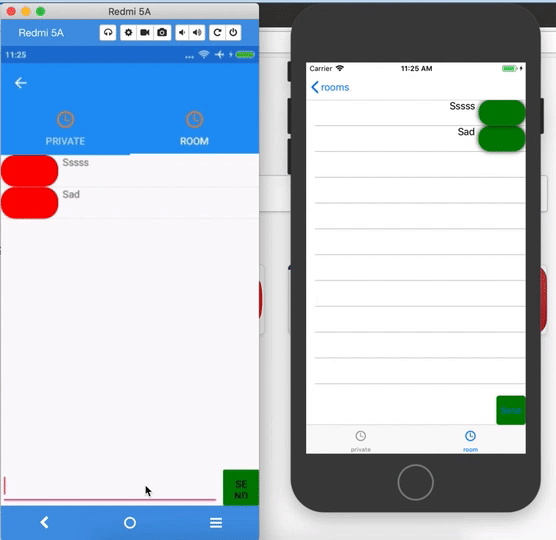

# chatkit-dotnet
SDK. Net for Pusher Chatkit https://pusher.com/chatkit (Xamarin Form/ Native) 

|||
|:---:|:---:|

## About
This project is maintained by Son Duong. 
I specialize in developing mobile applications using Xamarin and native technology stack. 

**Looking for developers for your project?** 

  

## What's inside
I make some features 
- User Presence https://pusher.com/docs/chatkit/reference/presence
- Fetch Users 
- Handle room subcribe 
- Handle conversation 

